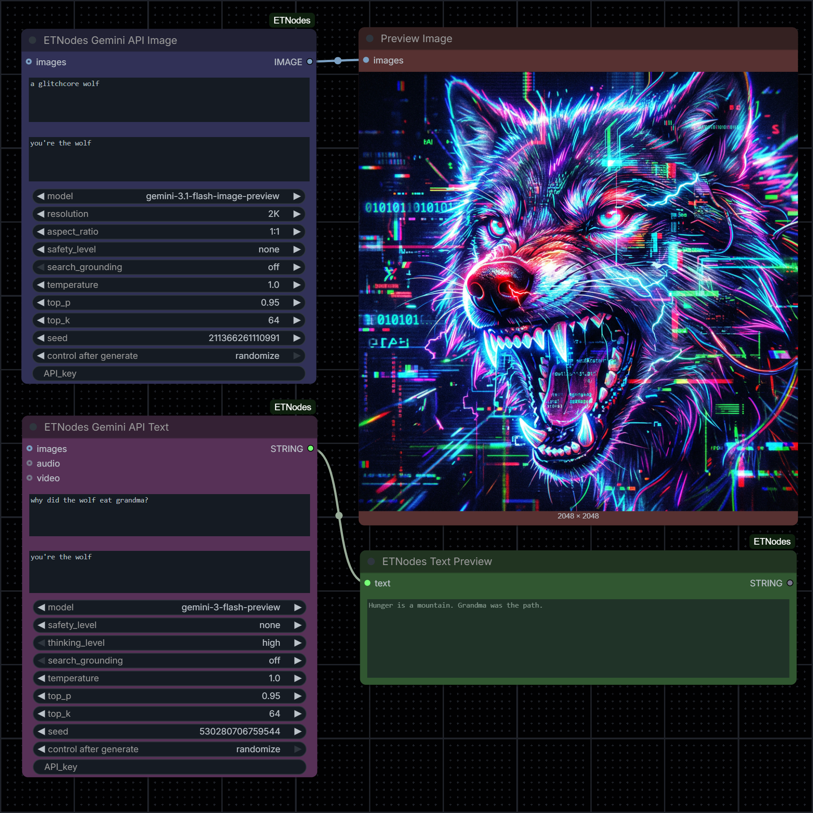

# ComfyUI-ETNodes

A collection of custom nodes for ComfyUI by **Edvard Toth** - [https://edvardtoth.com](https://edvardtoth.com)

> [!NOTE]
> This projected was created with a [cookiecutter](https://github.com/Comfy-Org/cookiecutter-comfy-extension) template. It helps you start writing custom nodes without worrying about the Python setup.

Are you looking for the most powerful, flexible, and feature-rich way to use Google's cutting-edge Gemini AI models inside your node-based workflows? Look no further. **These are probably the most full-featured Gemini API nodes out there.** 

Deeply integrate the latest multimodal reasoning and image generation capabilities directly into ComfyUI, with full control over advanced generation parameters, search grounding, safety settings, and more.

## 🚀 Recent Updates

- **Official SDK Migration**: Fully updated and rewritten to utilize Google's new, official `google-genai` Python SDK for maximum stability and future-proofing.
- **Latest Model Support**: Immediate day-1 support for the newest Gemini 3 model family, including text reasoning and image generation.
    - Also includes reference mappings for popular community model designations:
        - `gemini-3-pro-image-preview` (Nano Banana Pro)
        - `gemini-3.1-flash-image-preview` (Nano Banana 2)
        - `gemini-2.5-flash-image` (Nano Banana)
- **New Features**: Added native support for advanced capabilities like **Search Grounding** (web-assisted generation) and configurable **Thinking Levels** for reasoning models!
- **Enhanced Tooltips**: All node inputs now feature detailed, updated tooltips to guide you through the new parameters and features.

## 📦 Quickstart

1. Install [ComfyUI](https://docs.comfy.org/get_started).
2. Install [ComfyUI-Manager](https://github.com/ltdrdata/ComfyUI-Manager).
3. Look up this extension in ComfyUI-Manager. If you are installing manually, clone this repository under `ComfyUI/custom_nodes`.
4. Restart ComfyUI.

> [!IMPORTANT]
> **API Key Setup**
> To use the Gemini API nodes, you need a free Google API key.
> While you can paste it directly into the nodes, it is **highly recommended** to set it as a `GEMINI_API_KEY` environment variable on your system for convenience and security. The nodes will automatically detect and use it!

---

## ✨ The Nodes

### ETNodes Gemini API Image

A powerhouse node that allows you to generate and edit images using the latest Google Gemini API models. It supports both **Text-to-Image** and **Image-to-Image** generation workflows.

**Key Features:**
- **Supported Models**: `gemini-3-pro-image-preview` (Nano Banana Pro), `gemini-3.1-flash-image-preview` (Nano Banana 2), `gemini-2.5-flash-image` (Nano Banana).
- **Multi-Image Prompting**: Supply up to 14 reference images simultaneously when using the Pro model!
- **Extensive Aspect Ratios**: Choose from an "auto" mode that automatically matches your input image aspect ratio, or select from over a dozen presets (including extreme ultra-wide 8:1 and tall 1:8 formats explicitly supported by the 3.1 Flash model).
- **Resolution Control**: Granular output resolution controls ranging from 1K to 4K (for Gemini 3 models).
- **Safety Overrides**: Full control over content moderation filters, including access to the experimental "OFF" bypass setting.
- **Search Grounding**: Toggle on to allow the model to search the web for up-to-date information to guide generation.
- **Advanced Generation Tuning**: Exposes `temperature`, `top_p`, `top_k`, and `seed` variables for fine-tuning visual variety and determinism.

### ETNodes Gemini API Text

A wildly versatile multimodal node that connects directly to Gemini LLMs for text generation and reasoning. It can simultaneously analyze, describe, and synthesize information from a combination of text, images, audio, and video inputs.

**Key Features:**
- **Supported Models**: `gemini-3.1-pro-preview`, `gemini-3-flash-preview`, `gemini-2.5-pro`, `gemini-2.5-flash`.
- **True Multimodality**: Feed it text prompts, standard ComfyUI images, audio, or even direct video files!
- **Thinking Level Control**: Specifically built for Gemini 3 reasoning models, allowing you to manually set the reasoning depth (High, Medium, Low) to balance output quality and generation speed.
- **Search Grounding**: Connect the LLM to live Google Search results for real-time querying and research directly inside ComfyUI.
- **System Prompts**: Define custom personas and behavioral instructions using dedicated system prompts.
- **Full Parameter Exposure**: Tweak safety levels, `temperature`, `top_p`, `top_k`, and `seed` settings for complete control over the generated text.

---

## 🛠️ Utility Nodes

To support your workflows and take full advantage of the LLM outputs, this repository also includes several lightweight utility nodes:

- **ETNodes List Items**: Quickly convert a multiline text block (like a list generated by Gemini) into a format the engine can iterate over.
- **ETNodes List Selector**: Easily pick a specific item from a list by its numerical index.
- **ETNodes Color Selector**: A simple drop-down utility that outputs standard color names.
- **ETNodes Text Preview**: A lightweight node used purely for displaying string outputs directly on the ComfyUI canvas, without saving files.

---

Interested in contributing? Check out the [contributing guide](CONTRIBUTING.md).
