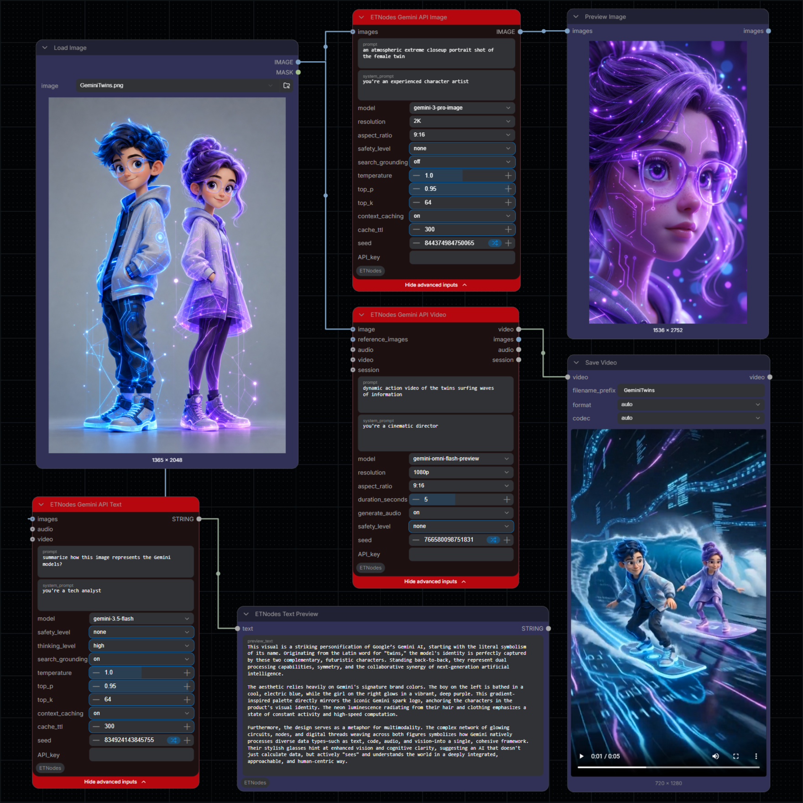

# ComfyUI-ETNodes

A collection of custom nodes for ComfyUI by **Edvard Toth** - [https://edvardtoth.com](https://edvardtoth.com)

> [!NOTE]
> This project was created with a [cookiecutter](https://github.com/Comfy-Org/cookiecutter-comfy-extension) template. It helps you start writing custom nodes without worrying about the Python setup.

Are you looking for the most powerful, flexible, and feature-rich way to use Google's cutting-edge Gemini AI models inside your node-based workflows? Look no further. **These are probably the most full-featured Gemini API nodes out there.** 

Deeply integrate the latest multimodal reasoning and image generation capabilities directly into ComfyUI, with full control over advanced generation parameters, search grounding, safety settings, and more.

## 🚀 Recent Updates

> [!IMPORTANT]
> **Welcome to the biggest update yet!** We've introduced groundbreaking new capabilities, a brand new node, and massive API improvements to supercharge your Gemini workflows inside ComfyUI.

- 🎬 **Brand New Gemini Video Node**: Support for the state-of-the-art **Gemini Omni Flash** (`gemini-omni-flash-preview`) model! Experience text-to-video generation, video-to-video editing, audio generation, and multimodal video analysis directly inside ComfyUI.
- ⚡ **Context Caching**: Save up to **90% on API costs** and drastically reduce latency when reusing large system prompts, multiple reference images, audio, or video inputs.
  - Requires a minimum payload of **4096 tokens** (automatically activated when the threshold is met).
  - A **`[CACHING ACTIVE]`** indicator will dynamically append to the node's title on the canvas when a cache hit occurs!
- 🗣️ **Session-Based Iterative Video Editing**: Chain multiple video nodes together using the new `session` connector to iteratively edit video outputs in a conversational multi-turn loop.
  - *Pro Tip:* Use ComfyUI's **fixed seed** setting when editing to prevent the model from regenerating the entire upstream sequence from scratch.
- 🖼️ **Modern Image & Text Models**: Support for the lightning-fast `gemini-3.1-flash-lite-image` model alongside updated, modern endpoints to keep your workflows cutting-edge.
- 🎛️ **Omni Flash Resolution & Audio Support**: Generate videos with optional synchronized background audio/dialogue, with up to 1080p resolution. Note that certain advanced settings combinations (like 1080p without sound) are subject to backend support and are being rolled out gradually.
- 🛠️ **Refactoring & Performance Improvements**: Standardized requirements with `google-genai>=2.6.0`, optimized imports, robust error handling, audio overflow noise prevention, dynamic frontend aspect ratio filters, and backend duration clamping.

## 📦 Quickstart

1. Install [ComfyUI](https://docs.comfy.org/get_started).
2. Install [ComfyUI-Manager](https://github.com/ltdrdata/ComfyUI-Manager).
3. Look up this extension in ComfyUI-Manager. If you are installing manually, clone this repository under `ComfyUI/custom_nodes`.
4. Restart ComfyUI.

> [!IMPORTANT]
> **API Key Setup**
> To use the Gemini API nodes, you need a free Google API key.
> While you can paste it directly into the nodes, it is **highly recommended** to set it as a `GEMINI_API_KEY` environment variable on your system for convenience and security. The nodes will automatically detect and use it!

---

## ✨ The Nodes

### ETNodes Gemini API Image

A powerhouse node that allows you to generate and edit images using the latest Google Gemini API models. It supports both **Text-to-Image** and **Image-to-Image** generation workflows.

**Key Features:**
- **Supported Models**: `gemini-3-pro-image` (Nano Banana Pro), `gemini-3.1-flash-image` (Nano Banana 2), `gemini-3.1-flash-lite-image` (Nano Banana 2 Lite).
- **Multi-Image Prompting**: Supply up to 14 reference images simultaneously when using the Pro model!
- **Extensive Aspect Ratios**: Choose from an "auto" mode that automatically matches your input image aspect ratio, or select from over a dozen presets. The UI dynamically filters out unsupported ratios depending on the selected model (e.g. `1:4`, `4:1`, `1:8`, `8:1`), with robust backend mapping fallbacks.
- **Resolution Control**: Granular output resolution controls ranging from 1K to 4K (only 1K is supported on Lite models).
- **Safety Overrides**: Full control over content moderation filters, standardizing on the stable `"none"` (maps to standard `BLOCK_NONE`) to disable probability filters while preserving safety metadata.
- **Search Grounding**: Toggle on to allow the model to search the web for up-to-date information to guide generation.
- **Advanced Generation Tuning**: Exposes `temperature`, `top_p`, `top_k`, and `seed` variables for fine-tuning visual variety and determinism.

### ETNodes Gemini API Text

A wildly versatile multimodal node that connects directly to Gemini LLMs for text generation and reasoning. It can simultaneously analyze, describe, and synthesize information from a combination of text, images, audio, and video inputs.

**Key Features:**
- **Supported Models**: `gemini-3.6-flash` (Default), `gemini-3.5-flash`, `gemini-3.5-flash-lite`, `gemini-3.1-pro-preview`.
- **True Multimodality**: Feed it text prompts, standard ComfyUI images, audio, or even direct video files!
- **Thinking Level Control**: Control the reasoning depth (High, Medium, Low) to balance output quality and generation speed for reasoning-enabled models.
- **Search Grounding**: Connect the LLM to live Google Search results for real-time querying and research directly inside ComfyUI.
- **System Prompts**: Define custom personas and behavioral instructions using dedicated system prompts.
- **Full Parameter Exposure**: Tweak safety levels, `temperature`, `top_p`, `top_k`, and `seed` settings for complete control over the generated text.

### ETNodes Gemini API Video

A powerhouse node designed to generate, edit, and orchestrate videos using Google's state-of-the-art **Gemini Omni Flash** model. It supports high-fidelity text-to-video, video-to-video editing, and conversational video refinement.

**Key Features:**
- **Supported Models**: `gemini-omni-flash-preview` (Gemini Omni Flash).
- **True Video Multimodality**: Generate gorgeous video clips from text prompts, start from an initial reference image/batch of style images, feed in reference audio, or provide an input video for advanced video-to-video editing.
- **Synchronized Audio Generation**: Toggle audio generation `on` to automatically generate high-quality, synchronized background audio or dialogue matching your prompt and video context.
- **Session-Based Iterative Editing**: Connect the output `session` to a subsequent Video node to perform multi-turn conversational video editing, refining details step-by-step.
- **Granular Controls**: Exposes resolution options (`720p`, `1080p`, `4K`), aspect ratios (`16:9`, `9:16`), duration (up to 10 seconds), and safety settings.
- **Advanced Determinism**: Adjust safety levels and seeds to balance creative variety and temporal consistency.

---

## 🛠️ Utility Nodes

To support your workflows and take full advantage of the LLM outputs, this repository also includes several lightweight utility nodes:

- **ETNodes List Items**: Quickly convert a multiline text block (like a list generated by Gemini) into a format the engine can iterate over.
- **ETNodes List Selector**: Easily pick a specific item from a list by its numerical index.
- **ETNodes Color Selector**: A simple drop-down utility that outputs standard color names.
- **ETNodes Text Preview**: A lightweight node used purely for displaying string outputs directly on the ComfyUI canvas, without saving files.

---

Interested in contributing? Check out the [contributing guide](CONTRIBUTING.md).
